<div align="center">

# **Recipes Without** 
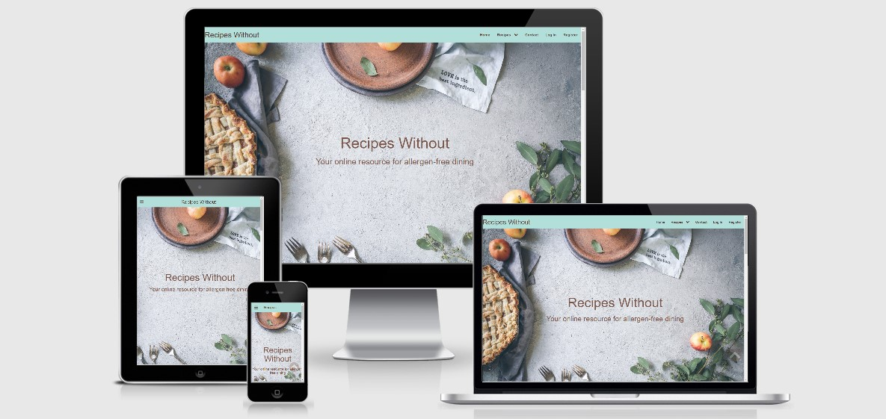
## A customisable online resource for recipes without gluten, dairy or eggs
Visit [Recipes Without](https://recipes-without.herokuapp.com/)
</div>

## **Table of Contents:**

- [Site Owner Goals](#site-owner-goals)
- [User Experience (UX)](#user-experience-ux)
  - [User Stories](#user-stories)
    - [First Time Visitor Goals](#first-time-visitor-goals)
    - [Returning Visitor Goals](#returning-visitor-goals)
    - [Frequent Visitor Goals](#frequent-visitor-goals)
  - [Design](#Design)
    - [Colours Used](#colours-used)
    - [Typography](#typography) 
    - [Imagery](#imagery)
    - [Layout](#layout)
        - [Accessible to all users via the navbar](#Accessible-to-all-users-via-the-navbar)
        - [Accessible to all users via the search boxes](#Accessible-to-all-users-via-the-search-boxes)
        - [Accessible to all users via the recipe cards](#Accessible-to-all-users-via-the-recipe-cards)
        - [Accessible to registered users via the navbar](#Accessible-to-registered-users-via-the-navbar)
        - [Accessible to registered users via the My Recipes page](#Accessible-to-registered-users-via-the-My-Recipes-page)
        - [Accessible to registered users via the Manage Account page](#Accessible-to-registered-users-via-the-Manage-Account-page)
        - [Accessible only to the site owner (admin user)](#Accessible-only-to-the-site-owner-(admin-user))
        - [Error Pages](#Error-Pages)
        - [Additional features available to logged in users](#Additional-features-available-to-logged-in-users)
        - [Additional features available to any user who is not logged in](#Additional-features-available-to-any-user-who-is-not-logged-in)
    - [Wireframes](#wireframes)
  - [Features](#features)
    - [Mobile Design Features](#mobile-design-features)
    - [Tablet Design Features](#tablet-design-features)
    - [Desktop Design Features](#desktop-design-features)
    - [Future Features](#future-features)
- [Technologies Used](#technologies-used)
  - [Languages Used](#languages-used)
  - [Frameworks, Libraries and Other Sources Used](#frameworks,-libraries-and-other-sources-used)
  - [Application Programming Interfaces Used (APIs)](#application-programming-interfaces-used-(APIs))
- [Information Architecture](#information-architecture)
    - [Database Choice](#database-choice)
    - [Categories Collection](#categories-collection)
    - [Users Collection](#users-collection)
    - [Recipes Collection](#recipes-collection)
- [Testing](#testing)
  - [Known Bugs and Fixes](#known-bugs-and-fixes)
  - [Defensive Programming](#defensive-programming)
- [Deployment](#deployment)
  - [Github Pages](#github-pages)
  - [Forking The Repository](#forking-the-repository)
  - [Making A Local Clone](#making-a-local-clone)
- [Credits](#credits)
- [Version Control](#version-control)


## Site Owner Goals:

Recipes Without is a recipe site that is designed to be a customisable online resource for those looking to 
prepare meals free from gluten, dairy or eggs. It is primarily intened for those suffering from allergies or intolerances. 
However the recipies can be enjoyed by anyone. 

The main objectives are as follows: 

1. To allow site users to find recipies without allergens.
2. To allow site users to view their own and other users recipes.
3. To allow site users to view recipes on allergen-specific pages.
4. To allow site users to add recipes to the site.
5. To allow site users to upvote/downvote their own, and other people's recipes.
6. To allow site users to update their own previously upladed recipes.
7. To allow site users to delete their previously uploaded recipes.
8. To allow site users to search the site for key words.
9. To allow the site owner (admin) to create, read, update and delete recipes added by any user - including themselves.
10. To allow the site owner (admin) to view and delete user recipes and user accounts.

The site uses CRUD (Create, Read, Update, Delete) functionality in order to create an interactive user experience. 

The site is based around a multi-page layout, with access to different pages and features available according to whether or 
not you are a logged in registered user, or whether you are the site owner (admin).

The pages are detailed in the 'Design' section below: 

### First Time Visitor Goals:
- To easily find out the main purpose of the site. 
- To easily navigate around the site to find relevant content.
- To create an acount and begin to upload and manage recipes.

### Returning Visitor Goals:
- To find out if any new recipes have been added to the site, so that the user can use them for mealtime inspiration.
- To create an account if the user has not previously done so.
- To create, read, update or delete any recipes previously added by the user.

### Frequent Visitor Goals: 
- To find out if any new recipes have been added to the site, so that the user can use them for mealtime inspiration..
- To maintain an account with recipes that are reglarly created, read, edited and deleted.

## Business Owner Goals:

- The site has one main goal, which is to collect recipies in order to publish them in a physical book at a later date.
The site will be populated by recipes uploaded by users, using the CRUD functionality. 

- The secondary goal is for the site to be monetised through the advertising of appropriate allergen-free ingredients
by appropriate companies. This will be implemented at a later date. 

## UX:

### User Stories:

1. I have an allergy or intolerance to gluten, dairy or eggs and would like to find some appropriate recipes so that 
I can prepare myself a tasty meal that is also safe for me to eat.
2. I have a friend or relative who has an allergy or intolerance to gluten, dairy or eggs, and I would like to find some 
recipes so that I can safely cook them a tasty meal. 
3. I am a restaurant or cafe owner, and I would like to find inspiration for dishes that I can add to my menu that would
be suitable for diners with intolerances to gluten, dairy or eggs.
4. I am any of the above users, and I would like to be able to upload, edit and delete my own recipes, without other 
users being able to tamper with them.
5. I am a user who enjoys cooking, and I would like to have all of my favourite recipes easily accessible in a digital format, 
so that I can access them from anywhere.
6. I am a user who has tried some of the recipes on the site, and would like to be able to upvote or downvote the ones that I have tried
so that I can recommend them to other site visitors.
7. I am a user who no longer wants to use the site, so I would like to be able to delete my account.
8. I am the site owner, and I would like to be able to edit or delete other users recipes if I decide that they are inappropriate 
or offensive.
9. I am the site owner and I would like to collect recipes uploaded by users so that I can create a book to sell. 
10. I want to be able to get in touch with the site owner so that I can share any comments or criticisms about the site.
11. I am a site user and would like to be able to search the site, so that I can quickly and easily locate recipes.
12. I have forgotten my password, and would like to be able to reset my password easily so that I can continue accessing my account.

### Design: 

**Home Page**
- The idea of the 'Recipes Without' homepage is to give the site visitor a preview of what they can find on the site. The hero image shows a tabletop
with food around the edges, and an empty space in the middle. Something is missing - which is a visual metaphor for 'Recipes Without', as all the 
recipes on the site have either no gluten, no dairy, or no eggs in them.
- Beneath the Hero image, there is a paragraph of text explaining the purpose and features of the site. This section is crucial, as without it the 
site visitor may not understand the purpose of the site, or may be unaware of its features.
- Below the paragraph, there is a search box, where the user can choose to perform a basic or advanced search of the site.
- Below the search box, there are 9 recipe cards - each of which display a randomly selected recipe from the database collection.
- At the bottom of the page is the footer Element. This contains links to Social Media sites, and a link back to the homepage. 

**Navbar:** All pages except for the error pages have a fixed navbar at the top. This displays different nav elements according to whether the user is 
logged in or not, or whether the user is the site owner (admin). Python checks whether there is a user in session 
``` 
if user in session
``` 
or whether the user is the site owner 
```
if username == "admin"
``` 
and passes this information to Jinja, so that the correct navbar links will be displayed.

**Footer:** All pages except for the error pages have a fixed footer at the bottom. From the footer, the user can navigate to the home, register, login and 
contact pages. There are also links to external social media sites.

### Layout:
#### Accessible to all users via the navbar:
- Home
- Gluten Free: Images and titles of all gluten free recipes are displayed on cards, as well as the number of upvotes and downvotes they have. If the user is logged in, they are able to upvote/downvote the recipe. 
- Dairy Free: Images and titles of all dairy free recipes are displayed on cards, as well as the number of upvotes and downvotes they have. If the user is logged in, they are able to upvote/downvote the recipe. 
- Egg Free: Images and titles of all gluten free recipes are displayed on cards, as well as the number of upvotes and downvotes they have. If the user is logged in, they are able to upvote/downvote the recipe. 
- Contact: A contact form with 'name', 'email address' and 'message' fields is displayed on a card. This is superimposed upon an image of a table of food.
- Login:  A contact form with 'username', 'password' and 'confirm password' fields is displayed on a card. This is superimposed upon an image of a table of food.
- register: A contact form with 'username', 'email address', 'memorable name', 'password' and 'confirm password' fields is displayed on a card. This is superimposed upon an image of a table of food.

### Accessible to all users via the search boxes:
- Search Results

### Accessible to all users via the recipe cards:
- Recipe: The entire recipe is displayed on a card, with an image of the recipe at the top of the card. The card is superimposed on a background image of fruit and vegetables on a table.

### Accessible to registered users via the navbar:
    
- Add Recipes: A card entitled 'Add Your Recipe' with 'choose category', 'recipe name', 'equipment needed', 'number of portions', 'ingredients', 'method', 'add an image url' and 'describe your image' fields are superimposed
on an image.  
- My Recipes: Images of all of the recipes added by that user are displayed on individual cards, along with their titles, date they were added, buttons to view, edit or delete the recipe, buttons to upvote or downvote the recipe, 
and the number of upvotes/downvotes that recipe has.  
- Manage account: A card panel saying "(User)'s Recipes". Beneath, there is one button linking to the user recipes page, and another button that invites the user to delete their account. When clicked, a modal opens which asks: 
"Are you sure you want to delete your account?" The user can then choose to click 'cancel', in order to close the modal, or "Yes I'm Sure" in order to delete their account.
The panel is superimposed on an image of food items on a table.    
- Log out: This is not a separate page, but logs the user out of the site when it is clicked.

### Accessible to registered users via the My Recipes page:
- Recipe (via the 'view recipe' 
- Edit Recipe: A card entitled 'Edit Recipe' with 'choose category', 'Edit Recipe Name', 'Edit Equipment needed', 'Edit Number of Portions', 'Edit Ingredients', 'Edit Method', 'Edit image url' and 'Edit Image Description' fields are superimposed
on an image or a chopping board with a knife and some herbs round the edges.  

### Accessible to registered users via the Manage Account page.
- My Recipes: 

### Accessible only to the site owner (admin user):
- Admin Section: A card panel with the title "Admin Section", which has a "Admin's Recipes" button that links to all of the recipes added by the site owner. Below, there are card panels that display a button, which when clicked, takes the user to 
the "Users Recipes" page. Additionally there is a button that invites the user to delete that account. When clicked, a modal opens which asks: 
"Are you sure you want to delete this account?" The user can then choose to click 'cancel', in order to close the modal, or "Yes I'm Sure" in order to delete their account.
The panel is superimposed on an image of cakes on plates on a table.
- User's Recipes:

### Error Pages:
- 404 and 500 error pages are provided. They both show a background image of an empty plate on a table. The 404 page has the words "No Recipes Here" superimposed on the picture, and the 500 page says "Something's Wrong". On both pages, there is a button
underneath which says: "Back To Recipes Without" on it, which when clicked take the user back to the home page. 

### Additional features available to logged in users:
- On the My Recipes Page: Delete Recipe, Upvote, Downvote.
- On the Recipe Category pages (Gluten Free, Dairy Free, Egg Free): Delete Recipe.
- On the Manage Account Page: Delete Account.

### Additional features available to any user who is not logged in:
- Reset Password form (accesssed via the login form).
- Password Reset (accessed via an email link generated from submitting the Reset Password form).

## Colours Used: 
- **Navbar and Footer:** The Materialize colour "teal lighten-4" (#b2dfdb) was used as the background colour, 
because it is striking and fresh looking, and contrasts well with the images used throughout the site. The Materialize colour
"brown-text text-darken-3" (#4e342e) because it was a good contrast with the background colour, whilst matching the colours of the images. 

- **Body:** The colour chosen for the body was chosen as the Materialize colour "grey lighten-3" (#eee) as it was felt tht it would make 
a subtle but distinct contrast with the other content. 

- **Buttons:** The Materialize colour "teal lighten-3" (#80cbc4) was chosen in order to match the Navbar and Footer. Although it is not 
an exact match with the navbar and footer background colour, it as felt by the developer that "teal lighten-4" would be too light, and would not
meet accessibility guidelines. The text on the buttons is white, in order to make a contrast with the buttons themselves.

- **Cards and Collapsibles:** The Materialize colour "grey lighten-5" was used for all collapsible and card elements in order to contrast with the body.
It was decided by the developer that white (#fff) would be too bright. 

- **Text:** The Materialize colour "brown" (#795548) was chosen for the text throughout the page because it contrasts well with the background colours and images, and looks attractive.

- **Scroll to Top Button:** The materialize colour "brown" (#795548) was chosen for the button, so that it matches the text on the site. The 'up' chevron is
white, so that it contrasts with the background, making it clearly visible. The button has an opacity of 0.3 so that it is discreet. On hover it has an opacity of 1. 

### Typography:
-  'Roboto' was chosen as the font for throughout the site, with a fallback of 'sans-serif' in case the 'Roboto font doesn't load. Roboto is 
clean and easy to read, which makes it an appropriate font for the text. For titles on the recipe pages, the font weight was increased to 700 to make it
stand out more.

### Imagery: 

The Hero image, background and recipe images were chosen for the site that were considered to be both striking, and appropriate for their context. Although site users 
can upload their own images to the site, the site owner still has overall control over what is on the site as they have the ability to delete recipes and accounts. 


- **Hero Image:**
The hero image was chosen as a visual metaphor, as it is a picture of an empty space with food/cooking items around the sides. The implication being that the picture is 'without' something.
Although some of the image is cut off on mobile and tablet screens, the developer considers this acceptable because it still looks visually appealing, and the metaphor still works well. 
The alternative of reducing the size of the image was not acceptable, because in order to make the whole image fit the screen, it was either too small to look good, or it became squashed and elongated.
- **Background Images:**
Background images were added to all pages except those that display recipe cards (with the exception of "recipe.html", which displays one entire recipe on the page). 
This was because the developer considered that those pages were already visually stimulating, so needed no more images. It was decided to leave them with no background image, even when the user 
has not uploaded any recipes, as a visual metaphor for there being nothing there, and to encourage the user to add content. The other pages were considered to be quite bland
by the developer, so inspirational food-related background images were added to beautify the site. Some of the images are repeated on different pages.

Even though some of the images are barely visible when viewed on a mobile site, because they are behind cards, the decision was made to include them on the mobile site as well
so that they add some colour and interest to the background. They were removed on pages where whole recipes are shown, because otherwise the images became elongated.

### Layout: 

- The Materialize framework was used throughout the site to add responsiveness and to help facilitate mobile-first design. 
The Materialize grid system has been used extensively throughout the site.
- The website is designed around a multi page layout, with navbar links, and appropriately placed buttons in order to help 
the user navigate their way around the site.

## Wireframes:

Original wireframes from the 17/01/2021 can be found here:
- <a href="assets/wireframes/sitemap-wireframes-recipes-without.pdf" target="_blank">Sitemap</a>
- <a href="assets/wireframes/desktop-wireframes-recipes-without.pdf" target="_blank">For Desktop</a>
- <a href="assets/wireframes/tablet-wireframes-recipes-without.pdf" target="_blank">For Tablet</a>
- <a href="assets/wireframes/smartphone-wireframes-recipes-without.pdf" target="_blank">For Smartphone</a>

Final Wireframes can be found here. Please note that not all pages with forms on them have been included as they all look much the same:
- <a href="assets/wireframes/final-smartphone-wireframes-recipes-without.pdff" target="_blank">Sitemap</a>
- <a href="assets/wireframes/final-desktop-wireframes-recipes-without.pdf" target="_blank">For Desktop</a>
- <a href="assets/wireframes/final-tablet-wireframes-recipes-without.pdf" target="_blank">For Tablet</a>
- <a href="assets/wireframes/final-smartphone-wireframes-recipes-without.pdf" target="_blank">For Smartphone</a>


### Mobile Design Features: 

The main features of the mobile version of the 'Recipes Without' website are detailed below:

- The mobile version of the site was designed for devices corresponding to the Materialize 's' class.

- The navbar has been collapsed, and is accessed by clicking on the 'hamburger' icon in the top left hand corner. When the 'hamburger' icon 
is clicked, the Materialize 'sidenav' element appears with all relevent elements displayed. 

- Where appropriate, the images used on the tablet and dektop versions have been replaced by images that are more suitable for small screens.

- All of the card elements have been collapsed into 'accordions', whereby each collapsed element needs to be clicked on in 
order to be viewed. Only one card is visible at a time, as multiple cards next to each other would have been inappropriate for 
the screen size. The decision to collapse the card elements was made to provide better UX, as otherwise the site visitor would 
have to scroll past too much content, and it would have been poor UX. On the left hand side of the collapsible, I have added a font awesome 
'concierge-bell' as it looks like a cloche.

### Tablet Design Features:

The tablet design was designed for screens corresponding to the Materialize 'm' class, and has the same features as the mobile version, except those 
detailed below. On screens wider than the Materialize 'm' class, the desktop version will be used.

- On pages where three or more recipe cards are displayed on the desktop version, only two card elements displayed rather than three, as the images 
looked squashed when there were three of them. Rather than 
being collapsed into an accordion, they are displayed next to each other as this is more visually appealing.

### Desktop Design Features:

The desktop design was designed for screens corresponding to the Matrialize 'l' class and above, and has some of the same features as the mobile and tablet versions.The differences are detailed below:

- The fixed navbar is not collapsed, and spans the width of the page.

- On pages where three or more recipe cards are displayed, they appear in rows of three. If the quantity of recipes is not divisible by three, the 'extra' recipes start a new row beneath the other recipes.
If the quantity of recipes is fewer than three, the recipes are aligned in the centre of the page.

- The images are an appropriate size for the screen size.

### Interactive Features:

'Recipes Without' has been designed as an interactive resource, built around the principles of CRUD (Create, Read, Update, Delete),and users can take all of these actions on the site.
- **Register:** The site visitor can add their details to open an account on the site. 
- **Login:** The site visitor can login to the site if they are an existing user.
- **Contact:** Any User can contact the site owner by email.
- **Upvote/Downvote:** Logged in registered users can upvote/downvote any recipe.
- **Edit Recipe:** Logged in registered users can edit their own recipes.
- **Reset Password:** Users who have forgotten their password can request a 'reset password' link to be emailed to them, so that they can reset their password.
- **Delete Recipe:** Logged in registered users can delete their own recipes.
- **My Recipes:** Logged in registered users can view all of their own recipes.
- **Admin Area:" If the logged in user is the site owner (Admin), they can view all of the usernames, view their recipes and delete their accounts. The 
site owner can also view their own recipes and delete their own account from this area.
- **Search:** Any user can use the search box to search the site for recipes.

### Future Features:

In future I would like to add the following features:
- **Pagination**: For better UX, I would like to add pagination to the pages with more than 9 recipe cards.This was attempted for several days, but I 
still couldn't get it to work. When I have more time I will do some more research and add it to the project.
- **Image Upload:** For improved UX, I would like to add the ability for site users to upload images as files, rather than URLs.
- **Back Button:** For improved UX, I would like to be able to have different 'back' buttons appear according to 
- **Advanced Search:** This was attempted for a considerable amount of time, but I couldn't get it to work. I will come back to this feature 
when I am more skilled in this area.

## Technologies Used:

### languages Used:
- HTML5
- CSS3
- Javascript
- Python

### Frameworks, Libraries and Other Sources Used:

- [Materialize-1.0.0](https://materializecss.com/) was used to help facilitate responsive design by the use of their grid system. It was also used for the cards, card panels, collapsibles navbars and footer.
- [JQuery](https://jquery.com/) was used to enable the Materialize elements and grid system.
- [Gitpod](https://gitpod.io/workspaces/) and [Github](https://github.com/). All code was written in Gitpod, and pushed to Github for storage and version control. 
- [Balsamiq](https://balsamiq.com/) was used to create wireframes for the project.
- [Font Awesome](https://fontawesome.com/) provides icons for the site.
- [Unsplash](https://unsplash.com/) was used to download images for the site.
- [Pixabay](https://pixabay.com/) was used to download images for the site.
- [Favicon.cc]( https://www.favicon.cc/?action=icon&file_id=793468) was used to generate the favicon - which is a knife, fork and spoon.
- [CompressImage.touler](https://compressimage.toolur.com/) was used to crompress and resize the image files to a more appropriate size for the site, and in order to 
speed up their load time.
- [PIP](https://pip.pypa.io/en/stable/installing/) was used to install tools needed in the project.
- [MONGODB-Atlas](https://www.mongodb.com/3) is the database for this project.
- [PYMONGO](https://pypi.org/project/pymongo/) was used so that Python and MongoDB could commuicate with one another.
- [FLASK](https://flask.palletsprojects.com/en/1.1.x/) was used in order to render pages.
- [Jinja](https://jinja.palletsprojects.com/en/2.11.x/) was used in order to easily display information from the backend easily in HTML.


## Information Architecture:

### Database Choice:
- MongoDB was chosen as the database for this project.

- Within MongoDB, 3 collections are used for 'Recipes Without':

#### Categories Collection: 

| Title         | DB Key        | Data Type |
|---------------|---------------|-----------|
| Category ID   | _id           | ObjectId  |
| Category Name | category_name | string    |

#### Users Collection:

| ID             | _id            | ObjectID |
|----------------|----------------|----------|
| Username       | username       | string   |
| Password       | password       | string   |
| Upvotes        | upvotes        | array    |
| Downvotes      | downvotes      | array    |
| Memorable Name | memorable-name | string   |
| Email Address  | email-address  | string   |

#### Recipes Collection:

| Title            | DB Key           | Data Type |
|------------------|------------------|-----------|
| Recipe ID        | _id              | ObjectID  |
| Category Name    | category_name    | string    |
| Recipe Name      | recipe_name      | string    |
| Equipment Needed | equipment_needed | string    |
| Portions         | portions         | string    |
| Ingredients      | ingredients      | string    |
| Method           | method           | string    |
| Image            | image            | string    |
| Added By         | added_by         | string    |
| Added On         | added_on         | string    |
| Alt Image        | alt              | string    |
| Upvotes          | upvotes          | INT32     |
| Downvotes        | downvotes        | INT32     |


## Testing:

Information about tests carried out can be found in a separate [testing.md](testing.md) file.

### Known Bugs and Fixes:

- **Upvote/Downvote:** The upvote/downvote buttons increment values to an array in the database when they are clicked.
I was trying to write code that would decrement the value of 'upvotes' when the user clicked 'downvote' **if** they had already 
clicked on 'upvote', and vice versa, using the $pull method. This doesn't currently work how it should, and users are able to upvote/downvote
recipes as many times as they like. I have spent a very long time trying to make this work, and will come back to it when I have more 
knowledge. I have left the code in place that doesn't work in order to help me debug it in future.

- **Upvote/Downvote:** The upvote/downvote feature was originally situated on the recipe cards on the homepage. I decided that this
was poor UX, as the page reloads when upvote or downvote is clicked. As the homepage displays a random selection of 9 recipes, the chances
are that the recipe that has been voted for will not be displayed again on the reload, which would be really annoying for the user.
I decided to add this feature to the 'recipe.html' page instead.

- **Upvote/Downvote:** If a user has clicked the upvote or downvote button, that button should disappear, so that they can't click it multiple times.
This was to be effected by a jinja 'if/else' statement. This feature worked perfectly when it was on the homepage, but not now it's on 'recipe.html' it 
doesn't. I consider this to be poor UX. However, I consider it to be less poor UX than having it on the homepage, and causing the issues it caused there.
As I am short of time, I will come back to this feature in a future release and make sure that it works. I have left the code in place in order to 
make it easier to debug in future.

- **Responsive Images:** I tried adding the 'responsive-img' class to the recipe images. It worked well with all the images that 
had been copied from the same source, and that were all the same size. However, different sized images from other sources elongated or
shortened the cards - which is poor UX, so I removed that class from all recipe cards.

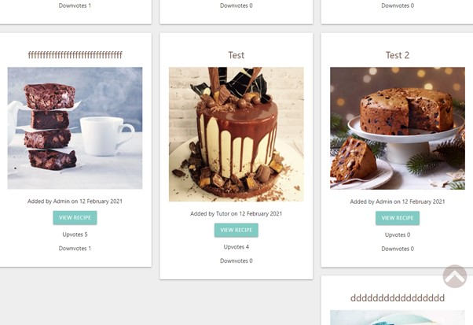

- **Password Reset:** If the user didn't have an email address stored in the DB, when trying to send a reset password link, the page
would display a flash message to say that the message had been sent even though it hadn't. This was fixed by ensuring there is an 'email'
field on the 'register' form, so that all users have a password stored in the database.

- **Edit Recipe:** On the edit recipe form, whitespace appears in the input fields and text areas after the edit has been submitted. I have spent some time trying to
figure out why this is happening, and I have not managed to work it out.

- **Scroll to Top Button:** The scroll to top button that is present on all pages is supposed to be invisible unless the user is scrolling. After
applying some CSS styling to the Footer, the button became invisible all the time. I 'fixed' the issue by making it visible all the time. 
However, I believe it to be better UX for it to be invisible until the user scrolls, so I left the Javascript code in place in order for 
me to be able to debug it at a later date.

- **Scroll to Top Button:** When the site is viewed on iOs 14.4, the scroll to top button is visible until it's clicked. Once clicked, it 
disappears. I fixed this by adding a media query that disables the scroll to top button on iOs devices.
```
@supports (-webkit-touch-callout: none) {
#myBtn {
  display: none;
    }
}
```

- **My Recipes and User Recipes:** When fewer than 3 recipe cards are displayed on these pages, they are aligned to the left. If I had more
time available, I would add the same conditional formatting as on 'search_results.html'. This will be added in due course.

### **Defensive Programming:** 
- To ensure that no sensitive material is visible to the public, all sensitive data is stored in an env file 
that is not pushed to github. The following code has been added to the 'edit_recipe' and 'delete_recipe' routes so that these pages can't be accessed
by unauthorised users. I plan to add the same checks to 'delete account' and 'admin_delete' routes,  but the code I have written for these routes 
is different, so I will need to spend more time working on it to acheive this. Conditional statements were also used in jinja to render the correct 
dtat for different users.

```
if recipe['added_by'] == session.get("user", None):
```

## Deployment: 

The project was written in Gitpod, pushed to a repository in Github for version control, and deployed to Heroku 
by following these steps:

1. Ensure that the requirements.txt, Procfile and gitignore files exist in your repository, and that they are up to date.

If not present, add them by typing the following commands into the CLI:

```
touch .gitignore
```

```
pip3 freeze --local > requirements.txt
```
for the requirements file.

```
echo web: python app.py > Procfile
```
for the Prcofile. Ensure that the Procfile has an upper-case P in the filename.

2. Inside the Procfile, make sure that it contains the following line:
```
web: python app.py
```
3. Delete any blank lines below the first line in the Procfile.

4. Inside the gitignore file, make sure that it contains the following lines of code so that the sensitive 
information contained within the env.py file and pycache directory will not be pushed to Github and made public:
```
env.py
__pycache__/
```

4. Login to Heroku, or sign up if you don't already have an account.
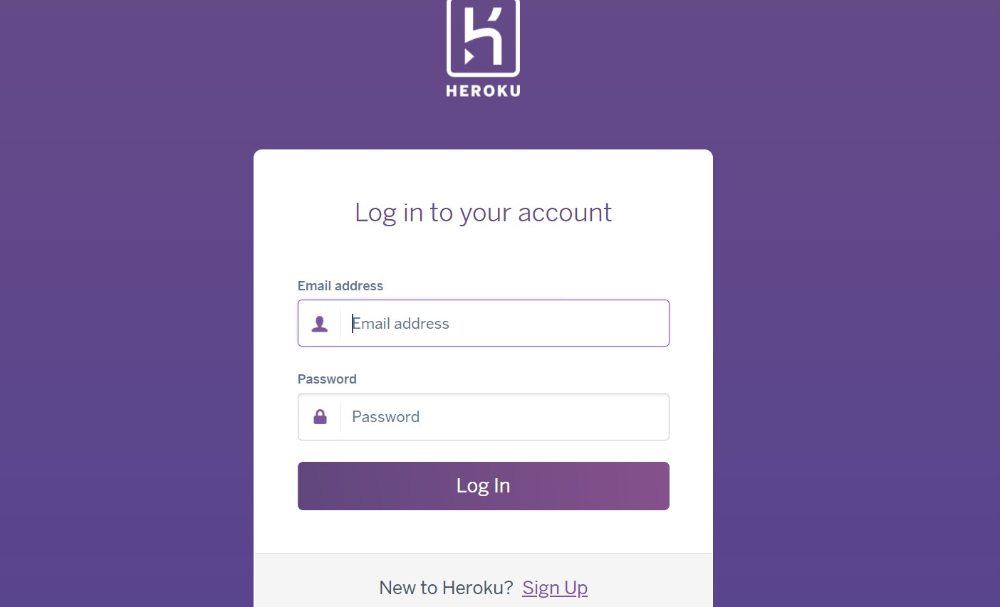

5. In the top right hand corner click on the 'new' button, and from the dropdown select 'create new app'.
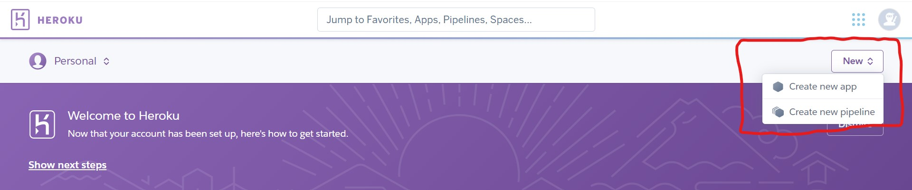

6. On the next screen, choose a unique name for your app, and select your region, and click 'Create app'.
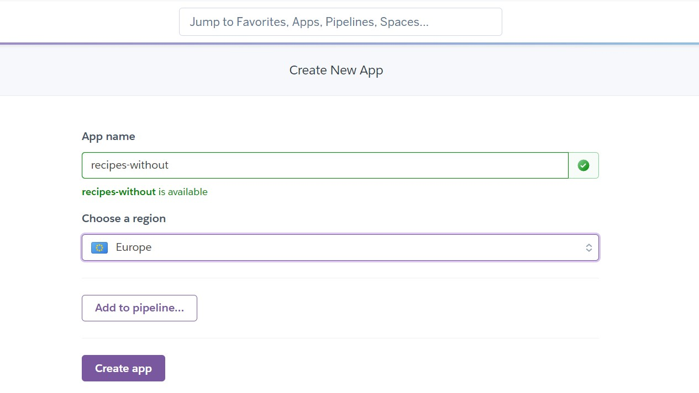

7. On the next page, click on 'connect to gitHub' next to the Github icon and search for your repository in the search box. 
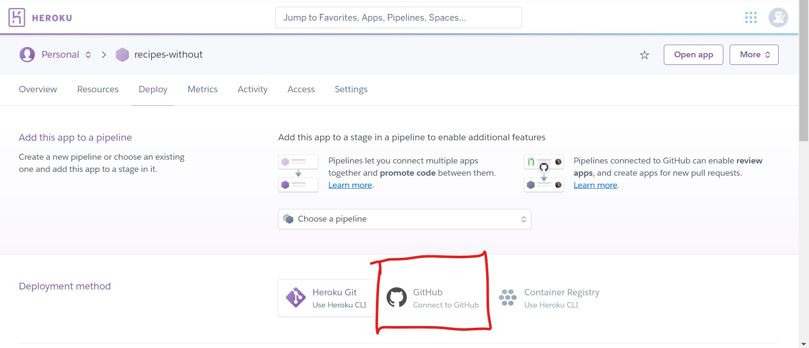

8.  When your repository is listed, click on connect.
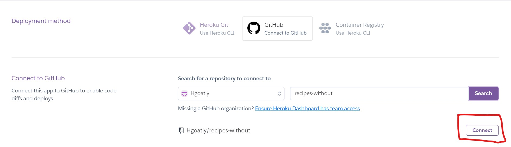

9. If successful, the text next to the Github icon will turn green, and say 'connected' 
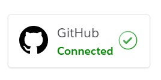

10. Click on 'Settings' tab at the top of the page:
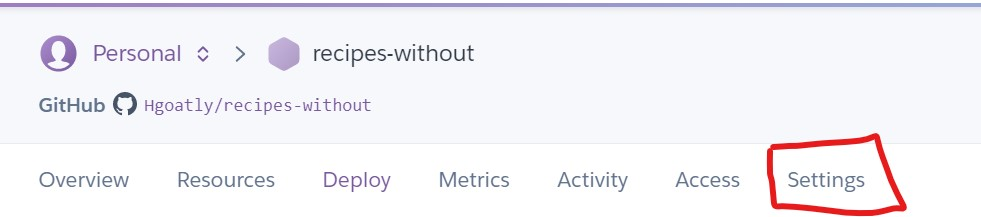

11. Scroll down the page and click on 'Reveal Config Vars'. Enter the following information as key/value pairs
into the empty input fields. They should match the content of your env.py file. Click 'add' after entering each key/value
pair in order to reveal new blank input fields.

```
IP = 0.0.0.0
PORT = 5000
SECRET_KEY = YOUR_SECRET_KEY
MONGO_URI = YOUR_MONGODB_URI
MONGO_DBNAME = DATABASE_NAME
```
The value for 'YOUR_SECRET_KEY' should match the one in your env.py file. 

12. Return to the deployment page, by clicking on the 'deploy' tab at the top of the page.
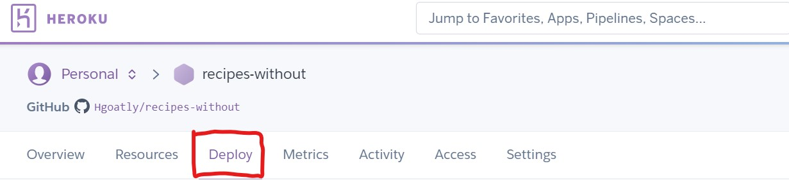

13. Click on 'Enable Automatic Deploys'. Select the branch you would like to deploy, in this case 'master',
and click 'Deploy Branch'.
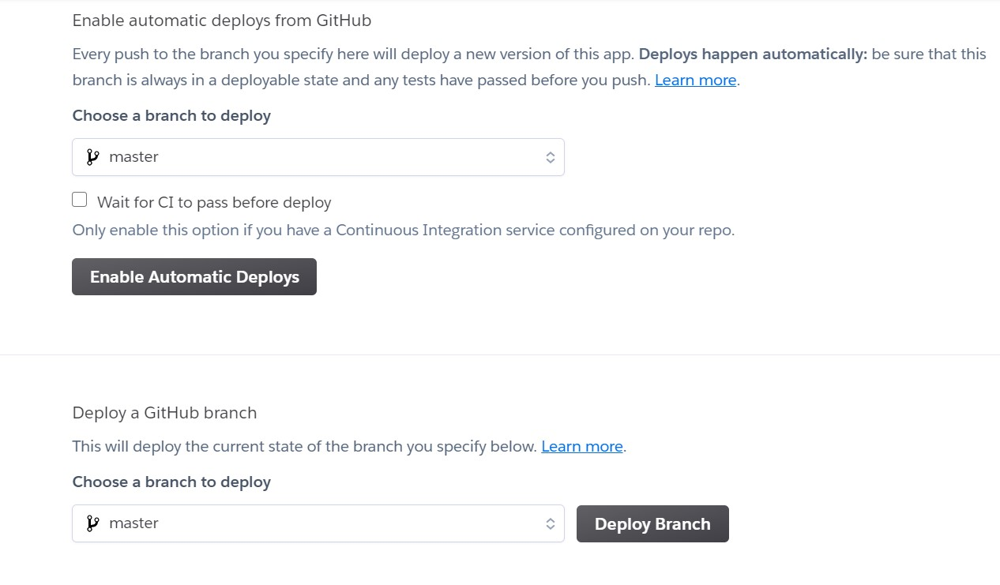

14. If successful, 'Your app was successfully deployed' should be displayed.


### Running the Site Locally:

In order to run this project locally, you will need to have an IDE installed on your computer. 
There are many available, but popular ones include [GitPod](https://gitpod.io/), 
[Visual-Studio](https://visualstudio.microsoft.com/) and [Eclipse](https://www.eclipse.org/ide/). 

** You will also need to install the following: **
- [PIP](https://pip.pypa.io/en/stable/)
- [Python3](python.org/doc/)
- [GIT](https://git-scm.com/book/en/v2/Getting-Started-Installing-Git) for version control.

Next, access the Recipes Without repository at: https://github.com/Hgoatly/recipes-without. 
Either download a zip file to your computer by clicking on the 'Code' button, and then clicking on 'Download Zip' 
from the dropdown, and extracting the files to an appropriate location on your computer.
If you have GIT installed, you can clone the repository if you prefer, by running the following command:
``` 
git clone https://github.com/Hgoatly/recipes-without.git 
```
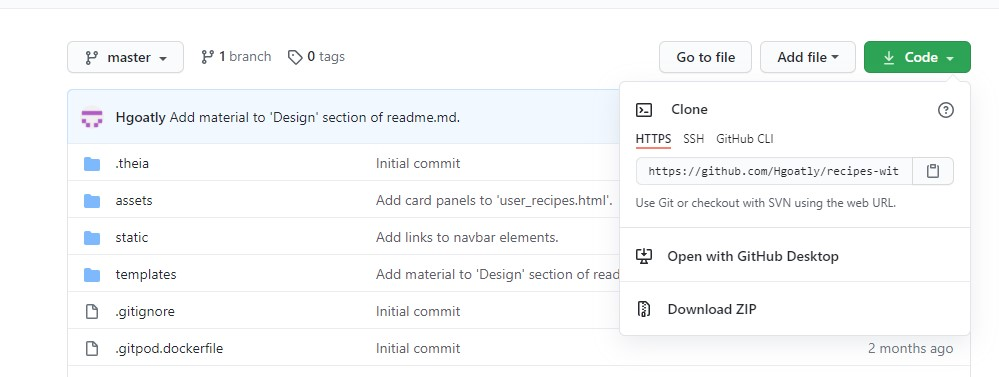

Ideally, use a virtual environment for the Python Interpreter. You can use Python's own built in interpreter by running this command: 
```
python -m .venv venv
```
Your Python commands may vary slightly according to the particular IDE you're using. Be sure to check the [documentation](https://docs.python.org/3/library/venv.html).

Your virtual environment can be activated with the following code: 
```
.venv\Scripts\activate 
```

The next step is to download all of your requirements for the project. The easiest way to do this is by running the following command:
```
pip -r requirements.txt.
```

After that, you will need to set up your SECRET_KEY and MONGO_URI that will link to your database. These should be stored in a file called .flaskenv.
The database for this project needs to be called recipes_without. Within the database, there are 3 collections: 'categories', 'users' and 'recipes'.

In order to run the app, please run the following command, which will open a port that will allow you to view the app.
``` 
python3 app.py
```
## Credits:

### Code:

- **Code Institute Course:**  The CI 'Task Manager' walkthrough project was referenced extensively throughout the project.
- **Code Institute Slack Channels:** Python code for the upvote/downvote routes was referenced from an example posted on CI Slack by ShaneMuir_Alumni
- **Tutorials:** Python Code for the 'contact' and 'send_password_reset' routes was referenced from this tutorial: https://realpython.com/lessons/sending-plaintext-emails-python/
- **W3 Schools:** W3 Schools was referenced for the scroll to top button.
- **Materialize:** The Materialize framework was used extensively throughout the project.

### Content:

- The 'Welcome Text' was written by the developer.
- All recipes and their images that were added by the developer are from [BBC-Good-Food](https://www.bbcgoodfood.com/)

### Media:

Background images on the website are from the following sources:
- **Hero Image** from [Unsplash](https://unsplash.com/).


### Acknowledgements:

- **My Mentor** Can Sücüllü, for help and guidance on this project.
- **My Friends and Family** for constant support, and feedback on the content and functionality.
- **Code Institute Slack Channel** for help answering my many questions.
- **Code Institute Tutor Support** for helping me work out why things weren't working how they should. In particular, Tim, Johann and Jo for their kindness and patience. 

## Version Control:

- Throughout the development process, regular commits have been made in Gitpod, which have been pushed to the Recipes Without Github repository.