# Recipes Without Testing:

The Recipes Without site was tested extensively, using the following processes:

# Table of Contents:

- [Chrome-Developer-Tools](#chrome-developer-tools)
- [W3c-Markup-Validation-Service](#W3C-markup-validation-service)
- [W3C-CSS-Validation-Service](#W3C-markup-validation-service)
- [JSHint](#jshint)
- [Testing the User Stories](#testing-the-user-stories)
  - [Create](#create)
  - [Read](#read)
  - [Update](#update)
  - [Delete](#delete)
- [Testing the 404 error page](#testing-the-404-error-page)
- [Manual Browser Compatibility Testing](#Manual-browser-compatibility-testing)

## Chrome Developer Tools:

- Chrome developer tools was used regularly to check the layout, and to check the console for errors.

## W3C Markup Validation Service:

- The [W3C Markup Validation Service](https://validator.w3.org/) was used to check that HTML used for the site was compliant with modern standards.
The code passed the validator's tests with no errors:

There was, however, a warning on all pages that display flash messages. This is because that section is empty until the flash images are created by the back end, so the validator thinks that it's an empty section.
 

## W3C CSS Validation Service: 

- The [W3C CSS Validation Service](https://jigsaw.w3.org/) was used to check that CSS used on the site was compliant with modern standards. The code passed the 
validator's tests with no errors or warnings. 

## PEP8 Python Validation:

- The [PEP8 Online Checker](http://pep8online.com/checkresult) was used to check that the Python code was compliant with modern standards.
The code passed witn no errors or warnings.

## JSHint:

- JSHint was used to test the validity of the Javascript code in the project. 'Let' was flagged as a warning, but once it was told to
recognise ECMAScript 6 features by adding: '/*jshint esversion: 6 */' at the top, all Javascript code passed with no errors or warnings. 
Undefined and unused vairables are noted however, but these are all either defined in other files, 
or in the case of the '$' sign, necessary for jquery - which has been used extensively in the project.

- Screenshot of JSHint warning about the use of 'let'.

- Screenshot of JSHint with /*jshint esversion: 6 */ added to the top of the file, and with no warnings.

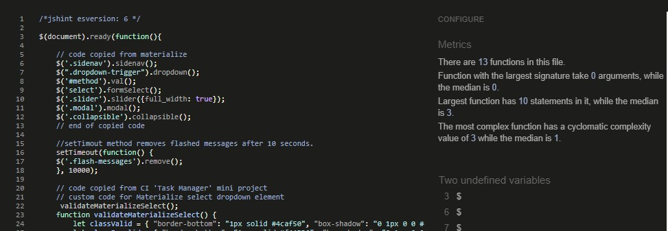

## Testing the User Stories:

- The following user stories are listed in the README.md file. Images have been inserted below each of them to show how their requirements 
have been fulfilled, and how they relate to the CRUD functionality.

### **READ:** The first 3 user stories are concerned with being able to read data found on the site. This stage of user story testing 
is concerned with users who are not logged in:

1. I have an allergy or intolerance to gluten, dairy or eggs and would like to find some appropriate recipes so that 
I can prepare myself a tasty meal that is also safe for me to eat.
2. I have a friend or relative who has an allergy or intolerance to gluten, dairy or eggs, and I would like to find some 
recipes so that I can safely cook them a tasty meal. 
3. I am a restaurant or cafe owner, and I would like to find inspiration for dishes that I can add to my menu that would
be suitable for diners with intolerances to gluten, dairy or eggs.

- Scroll down the homepage to where a slection of recipe cards are shown:
    
    - **Test Case 1**
    - Ensure that the all recipe cards render as expected, with title, image, 'view recipe' button, number of upvotes, 
    and number of downvotes displayed on them. 
    - **Expected Result**: Recipe cards should render as described above.
    - **Actual Result**: Recipe cards render as described above.
    - **Pass/Fail**: Pass.

- Click on the 'view recipe' card to find and read the entire recipe:

 - **Test Case 2**
    - Ensure that the 'view recipe' button-link takes the user to the 'recipe.html' page. Ensure that on the 'recipe.html' 
    page, the recipe renders as expected, with the recipe title, image, equipment needed, ingredients, method, portions, added by,
    added on, number of upvotes, number of downvotes, and a link back to the homepage.
    and number of downvotes displayed on them. . 
    - **Expected Result**: recipe.html page should render as described above.
    - **Actual Result**: recipe.html page renders as described above.
    - **Pass/Fail**: Pass.

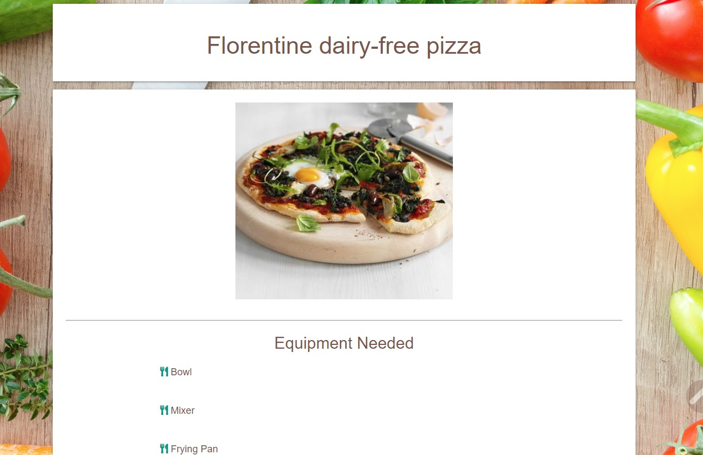
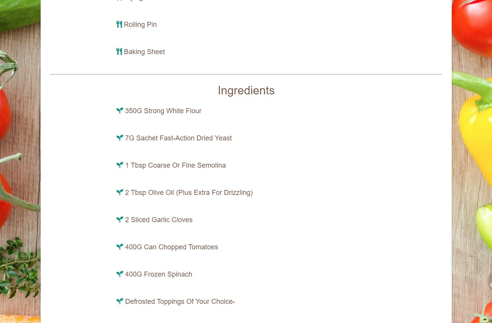
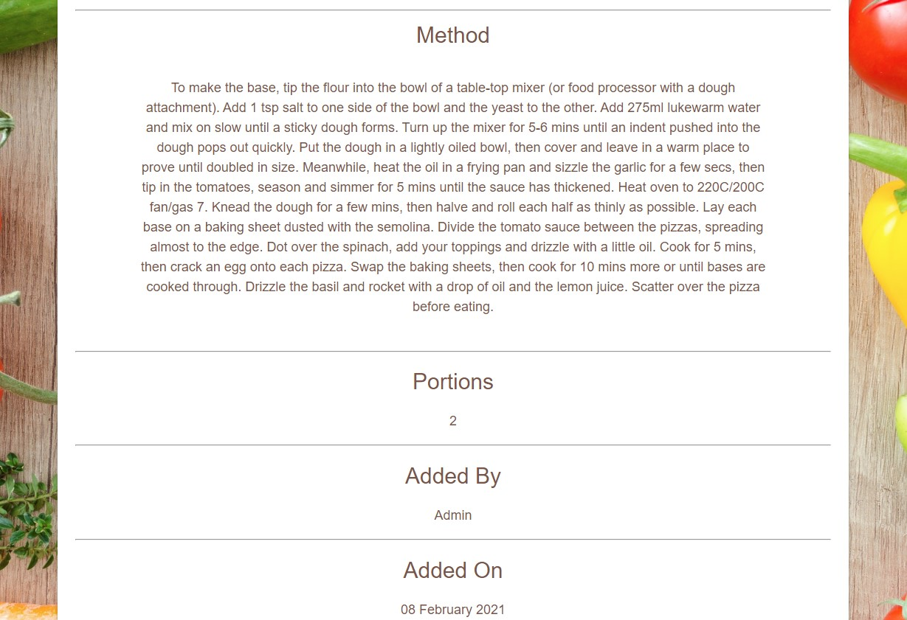
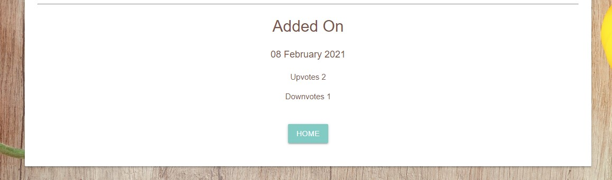

- Navigate to 'gluten-free.html' by clicking the link on the 'recipes' navbar link, and choosing 'Gluten Free' from the dropdown. 

 - **Test Case 3**
    - Ensure that the all recipe cards render as expected, with title, image, 'view recipe' button, number of upvotes, 
    and number of downvotes displayed on them.
    - **Expected Result**: gluten_free.html page should render as described above.
    - **Actual Result**: gluten_free.html page renders as described above.
    - **Pass/Fail**: Pass.

- Navigate to 'dairy-free.html' by clicking the link on the 'recipes' navbar link, and choosing 'Dairy Free' from the dropdown. 

 - **Test Case 3**
    - Ensure that the all recipe cards render as expected, with title, image, 'view recipe' button, number of upvotes, 
    and number of downvotes displayed on them.
    - **Expected Result**: dairy_free.html page should render as described above.
    - **Actual Result**: dairy_free.html page renders as described above.
    - **Pass/Fail**: Pass.

- Navigate to 'egg-free.html' by clicking the link on the 'recipes' navbar link, and choosing 'Egg Free' from the dropdown. 

 - **Test Case 4**
    - Ensure that the all recipe cards render as expected, with title, image, 'view recipe' button, number of upvotes, 
    and number of downvotes displayed on them.
    - **Expected Result**: egg_free.html page should render as described above.
    - **Actual Result**: egg_free.html page renders as described above.
    - **Pass/Fail**: Pass.

- Navigate to Gluten Free, Egg Free or Dairy Free pages

- **Test Case 5**
    - Ensure that the view recipe button on each card navigates the user to 'gluten_free_recipe.html', 'egg_free_recipe.html' or 'dairy_free_recipe.html',
    - **Expected Result**: 'view recipe' button should operate as described above.
    - **Actual Result**: 'view recipe' button operates as described above.
    - **Pass/Fail**: Pass.

### **Create:** User stories 4 and 5 are concerned with being able to create data on the site. This stage of user story testing is 
concerned with logged in and registered users:

4. I am any of the above users, and I would like to be able to upload, edit and delete my own recipes, without other 
users being able to tamper with them.
5. I am a user who enjoys cooking, and I would like to have all of my favourite recipes easily accessible in a digital format, 
so that I can access them from anywhere.

- Navigate to 'register' by clicking the 'register' link on the navbar or on the footer. 

 - **Test Case 6**
    - Ensure that the the register card panel is rendered in front of the background image. The following fields should be displayed:
    username, email address, memorable name, password, and compare password.
    - **Expected Result**: register.html page should render as described above.
    - **Actual Result**: register.html page renders as described above.
    - **Pass/Fail**: Pass.

- Complete the 'Register' form.
    - **Test Case 7*
    - Ensure that submit button takes the user to 'my_recipes.html' when clicked. Ensure that form validation is present when the expected format
    is not followed.
    - **Expected Result**: register.html page should render as described above, form validation should be present, and submit button should take the user to 'my_recipes.html' when clicked.
    - **Actual Result**: register.html page renders as described above, form validation is present, and submit button takes the user to 'my_recipes.html' when clicked.
    - **Pass/Fail**: Pass.

- Navigate to 'Add Recipes' by clicking on the navbar link, or on the 'Add Recipe' button that is displayed when the 'My Recipes' page shows no recipes.

- **Test Case 8**
    - Ensure that the the Add Recipes card panel is rendered in front of the background image. The following fields should be displayed:
    username, email address, memorable name, password, and compare password.
    - **Expected Result**: register.html page should render as described above.
    - **Actual Result**: register.html page renders as described above.
    - **Pass/Fail**: Pass.

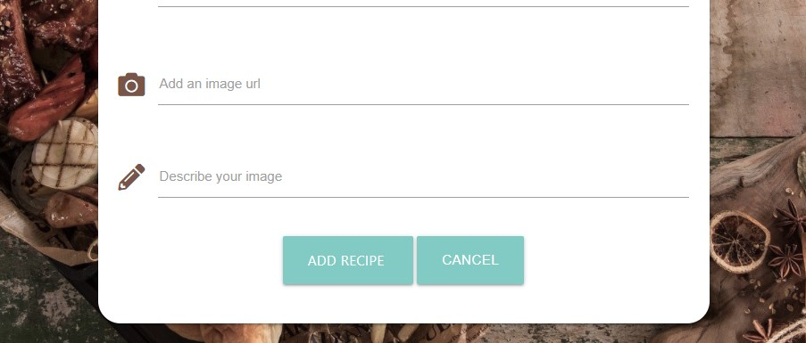

- Complete the 'Add Recipe' form.
    - **Test Case 9**
    - Ensure that submit ('Add Recipe') button takes the user to 'my_recipes.html' when clicked. Ensure that form validation is present when the expected format
    is not followed, and that the 'Add Recipe' button takes the user to the 'my recipes' page, where the newly added recipe is displayed.
    - **Expected Result**: 'add_recipes.html' page should render as described above, form validation should be present, and submit button should take the user to 'my_recipes.html' when clicked, 
    where the newly uploaded recipe is displayed.
    - **Actual Result**: 'add_recipes.html' page renders as described above, form validation is present, and submit button takes the user to 'my_recipes.html' when clicked, 
    where the newly uploaded recipe is displayed.
    - **Pass/Fail**: Pass.

- Navigate to 'My Recipes' by submitting the 'Add Recipes' form, registering, logging in, or by clicking the navbar link:
    - **Test Case 10**
    - Ensure that if the user has uploaded any recipes, all user recipe cards render as expected, with title, image, date recipe was added, 'view recipe', 'edit recipe' and 'delete' button, number of upvotes, 
    and number of downvotes displayed on them.
    - **Expected Result**: my_recipes.html page should render as described above.
    - **Actual Result**: my_recipes.html page renders as described above.
    - **Pass/Fail**: Pass.

### **Update:** User stories 4, 6 and 7 are concerned with being able to update data on the site. This stage of user story testing is 
concerned with logged in and registered users:

- Navigate to 'Edit Recipe' by clicking on one of the 'edit recipe' buttons located on recipe cards on the 'My Recipes' page.
    - **Test Case 11**
    - Ensure that the 'Edit Recipe' on the recipe cards button take the user to 'edit_recipes.html' when clicked. Ensure that form validation is present when the expected format
    is not followed, and that the 'Edit Recipe' button displays the flash message ' the user to the 'my recipes' page, where the newly added recipe is displayed.
    - **Expected Result**: 'edit_recipes.html' page should render as described above, form validation should be present, and submit button should take the user to 'my_recipes.html' when clicked, 
    where the newly uploaded recipe is displayed, and the flash message is displayed.
    - **Actual Result**: 'edit_recipes.html' page renders as described above, form validation is present, and submit button takes the user to 'my_recipes.html' when clicked, 
    where the newly edited recipe is displayed.
    - **Pass/Fail**: Pass.

- Navigate to 'My Recipes' by submitting the 'Add Recipes' form, registering, logging in, or by clicking the navbar link. From there, click on 
'view recipe' in order to navigate to 'recipe.html' 
    - **Test Case 12:**
    - Ensure that thumbs up (upvote) and thumbs down (downvote) buttons are present at the bottom of the card panel. Ensure that when clicked they increment the upvotes/downvotes 
    displayed on the page.
    - **Expected Result:** 'Upvote' and 'downvote' buttons are present at the bottom of the card panel. When clicked they increment the upvotes/downvotes 
    displayed on the page.
    - **Actual Result:** 'Upvote' and 'downvote' buttons are present at the bottom of the card panel. When clicked they increment the upvotes/downvotes 
    displayed on the page.
    - **Pass/Fail**: Pass.

- Navigate to 'My Recipes' by submitting the 'Add Recipes' form, registering, logging in, or by clicking the navbar link.
    - **Test Case 13:**
    - Ensure that a 'delete' button is present on each recipe card, and that when clicked it opens a modal, which says: 'Confirm Delete
    Are you sure you want to delete this recipe?'. Below are these options: 'Yes I'm Sure' and ' Cancel'. Ensure that when clicked, 'cancel' 
    closes the modal and returns the user back to their 'my recipe' page, 
    and that when 'yes I'm sure' is clicked, the recipe is deleted, and a flash message is displayed confirming this.
    - **Expected Result:** A modal is triggered when 'delete' is clicked, which invites the user to cancel the action, or confirm that they want to delete the recipe.
    - **Actual Result:** A modal is triggered when 'delete' is clicked, which invites the user to cancel the action, or confirm that they want to delete the recipe.
    - **Pass/Fail**: Pass.

## **Delete:** User stories 7 and 8 are concerned with being able to delete data from the site:

7. I am a user who no longer wants to use the site, so I would like to be able to delete my account.
8. I am the site owner, and I would like to be able to edit or delete other users recipes if I decide that they are inappropriate 
or offensive.

- Navigate to 'Manage Account' by clicking the navbar link.
    - **Test Case 14:**
    - Ensure that when clicked, the 'Manage Account' link takes the user to their 'manage account' page, where a card panel is displayed with 'my recipes' and 
    'delete account' buttons are displayed. Ensure that when 'my recipes' is clicked, it takes the user to their 'my recipes' page. Ensure that when 
    'delete account' is clicked, a modal opens which asks: 'Confirm Delete Are you sure you want to delete your account?' When 'cancel' is clicked,
    ensure that the modal is closed, and the user is returned to their 'manage account' page. Ensure that when 'Yes I'm Sure' is clicked, the account is deleted.
    - **Expected Result:** Actions taken are as detailed above.
    - **Actual result: ** Actions taken are as detailed above.
    - **Pass/Fail**: Pass.

### **If the site owner is logged in:** 

- Navigate to 'Admin Section' via the navbar.
    - **Test Case 15:**
    - Ensure that when clicked, the 'Admin Section' link takes the user to 'admin.html', and that the card panel at the top of the page says
    'Admin Section', with a button that links to all of the site owner's recipes. Ensure that below, all user accounts are displayed on separate card panels
    with button-links to 'User's Recipes' and 'Delete Account'.
    - **Expected Result:** 'admin.html' will display card panels for each user, with links to all their recipes, and a delete button.
    - **Actual Result:** 'admin.html' displays card panels for each user with links to all their recipes, and a delete button.
    - **Pass/Fail**: Pass.

    - **Test Case 16:**
    - Ensure that when clicked, the 'Admin's Recipes' and 'User Recipes' cards navigate the user to 'user_recipes.html' 
    - **Expected Result:** 'Admin's Recipes' and 'User Recipes' buttons navigate the user to 'user_recipes.html'
    - **Actual Result:** ''Admin's Recipes' and 'User Recipes' buttons navigate the user to 'user_recipes.html'.
    - **Pass/Fail**: Pass.

    - **Test Case 17:** 
    - Ensure that when clicked, the 'delete account' button opens a modal that says: 'Confirm Delete Are you sure you want to delete this account?'
    Ensure that 'yes I'm sure' and 'cancel' buttons are displayed. Ensure that when 'yes I'm sure' is clicked, the account is deleted, and that when 
    'cancel' is clicked, the modal will close, and return the site owner to 'admin.html'.
    - **Expected Result:** The buttons will perform as described above.
    - **Expected Result:** The buttons perform as described above.
    - **Pass/Fail**: Pass.

  
 

## User story 9 is concerned with being able to read data that has been uploaded to the site. It is also concerned with one 
of the business owner's goals:

9. I am the site owner and I would like to collect recipes uploaded by users so that I can create a book to sell. 

'The site has one main goal, which is to collect recipies in order to publish them in a physical book at a later date.
The site will be populated by recipes uploaded by users, using the CRUD functionality.'

The fact that the recipes will be used to create a book is explained in the welcome text on the homepage

 

- **Test Case 18:** 
    - Ensure that registered and logged in users are able to upload recipes to the site.
    - **Expected Result:** registered and logged in users are able to upload recipes to the site.
    - **Actual Result:** registered and logged in users are able to upload recipes to the site.
    - **Pass/Fail**: Pass.

## Contact: user story 10 is concerned with being able to contact the site owner:

10. I want to be able to get in touch with the site owner so that I can share any comments or criticisms about the site.

- Navigate to the contact page, by clicking the link on the navbar or the footer.
- **Test Case 19:** 
    - Ensure that any user is able to contact the site user via the contact form.
    - **Expected Result:** When the contact form is submitted, the site owner's email (recipetest579@gmail.com) 
    recieves an email from the site, and a flash message on the contact page confirms that an email has been sent.
    - **Actual Result:** When the contact form is submitted, the site owner's email (recipetest579@gmail.com) 
    recieves an email from the site, and a flash message on the contact page confirms that an email has been sent.
    - **Pass/Fail**: Pass.

- Screenshot of email account inbox where the email has been received.

## **Search:** user story 11 is concerned with being able to search the site.

11. I am a site user and would like to be able to search the site, so that I can quickly and easily locate recipes.

- Navigate to the home page, by clicking the link on the navbar or the footer, or by clicking the site logo.

- **Test Case 20:** 
    - Ensure that when a search item is entered into the search box and submitted, the resuts are displayed on 'search results.html'. 
    If no results are found, then the user is informed by text saying 'Sorry. No recipes found.'
    - **Expected Result:** when a search item is entered into the search box and submitted, the resuts are displayed on 'search results.html'. 
    If no result is found, the user is informed that that is the case.
    - **Actual Result:** when a search item is entered into the search box and submitted, the resuts are displayed on 'search results.html'. 
    If no result is found, the user is informed that that is the case.
    - **Pass/Fail**: Pass.

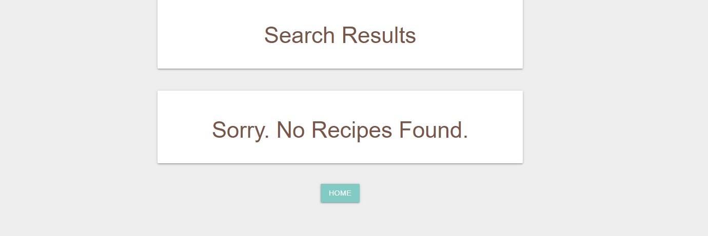
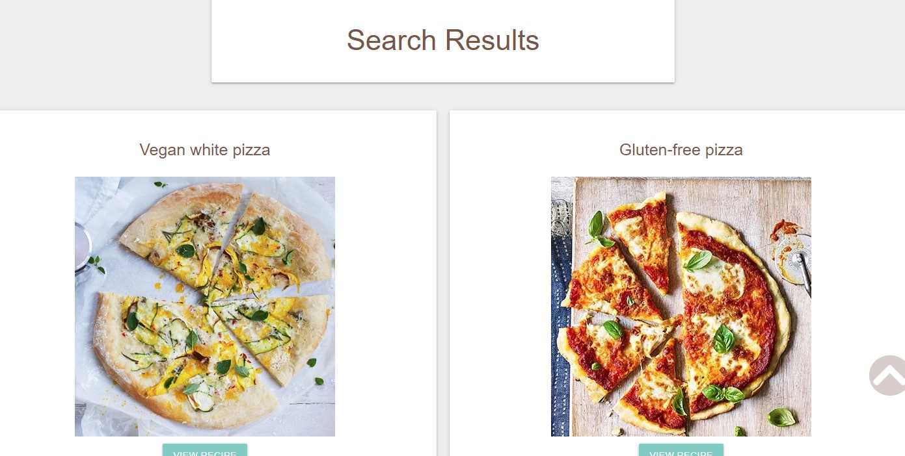

## **Reset Password:** user story 12 is concerned with a user being able to reset their password if they have forgotten it:

- Navigate to the login page, by clicking the link on the navbar. Click the 'reset' button under the text that says 'Forgotten Password?'
When clicked, ensure that the user is taken to 'reset_password.html.' 

- **Test Case 20:** 
    - Ensure that When the form has been filled out and submitted, ensure that a flash message is 
displayed confirming that the email has been sent. Check email inbox to ensure that email has been received. Click link, and be directed to 
Recipes Without 'reset_password.html'.Once form has been filled in and submitted, the MongoDB 'users' collection will be updated. 
    - **Expected Result:** Email will have been sent by recipetest579@gmail.com email account, and received by the user's email account. 
    Don't forget to check your junk or spam folder.
    - **Actual Result:**Email will have been sent by recipetest579@gmail.com email account, and received by the user's email account
    Don't forget to check your junk or spam folder.
    - **Pass/Fail**: Pass.

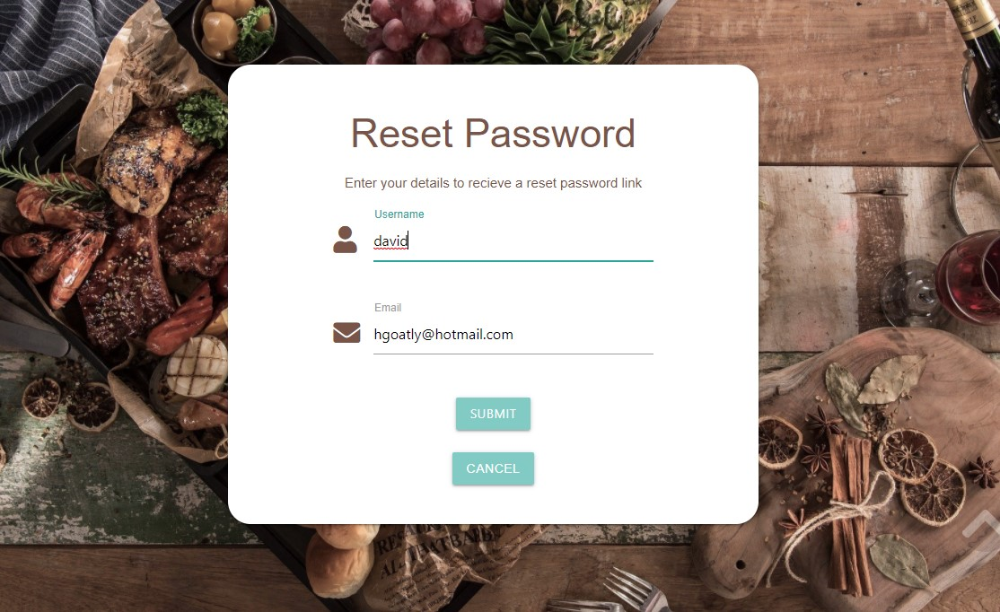
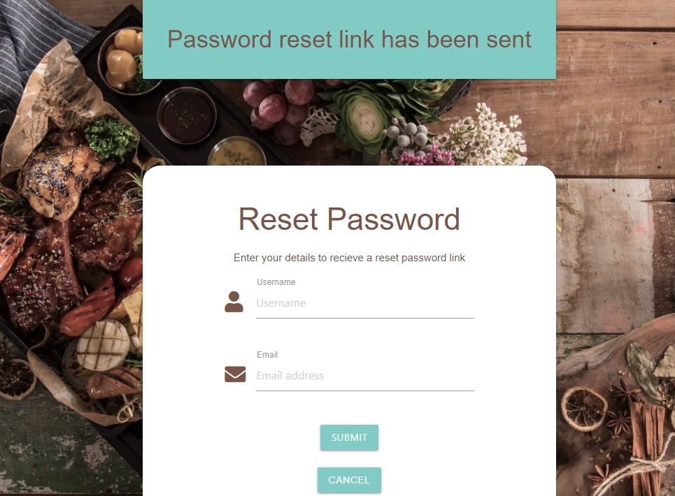

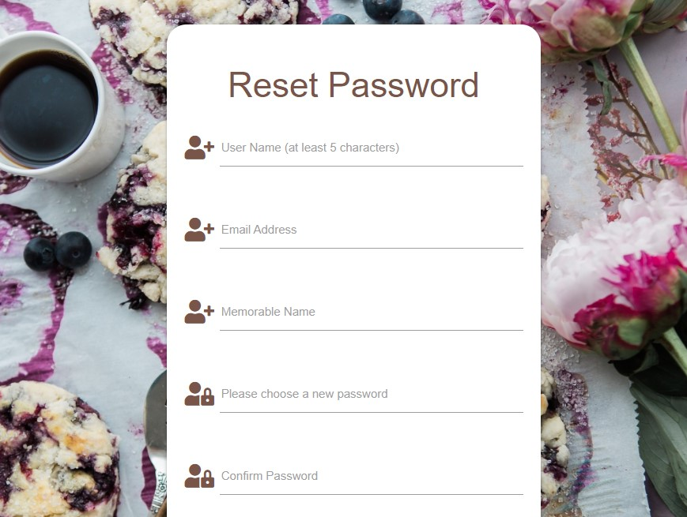

Screenshots will not be added to show the updated values in the MongoDB collection, because it contains sensitive password information. 

## **Manual Browser Compatibility Testing:**

Functionality was tested on a variety of browsers. The results are detailed below. 
Tests were not run on Internet Explorer as it is rarely used now.
Tests were not run on Safari, as the developer only has access to a PC.

|                    |                      |                                                                                                                                                  | Windows 10 Home Edition 1909. 64 bit. |                                                          |       |                | Apple iPhone       |
|--------------------|----------------------|--------------------------------------------------------------------------------------------------------------------------------------------------|---------------------------------------|----------------------------------------------------------|-------|----------------|--------------------|
| Page/Functionality | Section              | Test                                                                                                                                             | Chrome                                | Firefox                                                  | Opera | Microsoft Edge | iOS (Version 14.4) |
| Home               | Navbar               | Verify Navbar loads                                                                                                                              | Pass                                  | pass                                                     | pass  | pass           | pass               |
|                    |                      | Verify Navbar links for non logged in site visitors load                                                                                         | pass                                  | pass                                                     | pass  | pass           | pass               |
|                    |                      | Verify Navbar links for logged in site visitors load when user logged in                                                                         | pass                                  | pass                                                     | pass  | pass           | pass               |
|                    |                      | Verify dropdown 'recipes' menu works, and displays 3 options                                                                                     | pass                                  | pass                                                     | pass  | pass           | pass               |
|                    |                      | Verify Navbar links for site owner (admin) load when site owner logged in                                                                        | pass                                  | pass                                                     | pass  | pass           | pass               |
|                    |                      | Verify links in welcome text work                                                                                                                | pass                                  | pass                                                     | pass  | pass           | pass               |
|                    | Hero Image           | Verify hero image is displayed correctly, with text centered correctly on top                                                                    | Pass                                  | pass                                                     | pass  | pass           | pass               |
|                    | Welcome Text         | Verify welcome text is rendered correctly                                                                                                        | pass                                  | pass                                                     | pass  | pass           | pass               |
|                    | Search Box           | Verify search box, search button and cancel button are rendered correctly                                                                        | pass                                  | pass                                                     | pass  | pass           | pass               |
|                    |                      | Verify search returns results correctly displayed on search results page                                                                         | pass                                  | pass                                                     | pass  | pass           | pass               |
|                    |                      | Verify feedback is given if no search results are returned                                                                                       | pass                                  | pass                                                     | pass  | pass           | pass               |
|                    |                      | Verify 'cancel' button re loads the page                                                                                                         | pass                                  | pass                                                     | pass  | pass           | pass               |
|                    |                      | Verify 'home' button on search results page works correctly                                                                                      | pass                                  | pass                                                     | pass  | pass           | pass               |
|                    | Recipe Cards         | Verify 9 recipe cards are displayed on the page, and that they are displayed correctly                                                           | pass                                  | pass                                                     | pass  | pass           | pass               |
|                    | Footer               | Verify footer renders correctly, with correct links displayed                                                                                    | pass                                  | pass                                                     | pass  | pass           | pass               |
|                    |                      | Verify all footer links work                                                                                                                     | pass                                  | pass                                                     | pass  | pass           | pass               |
|                    | Scroll to top button | Verify Scroll to top button is displayed                                                                                                         | pass                                  | pass                                                     | pass  | pass           | pass               |
|                    |                      | Verify Scroll to top button works correctly                                                                                                      | pass                                  | pass                                                     | pass  | pass           | pass               |
|                    |                      | Verify Scroll to top button is invisible until scroll                                                                                            | fail                                  | fail                                                     | fail  | pass           | pass               |
| Gluten Free        | Recipe Dropdown      | Verify navbar recipe dropdown displays 'Gluten Free'                                                                                             | pass                                  | pass                                                     | pass  | pass           | pass               |
|                    | GlutenFree Page      | Verify 'Gluten Free' on navbar dropdown navigates to 'gluten_free.html'                                                                          | pass                                  | pass                                                     | pass  | pass           | pass               |
|                    |                      | Verify recipe cards render as expected                                                                                                           | pass                                  | pass                                                     | pass  | pass           | pass               |
|                    |                      | Verify navbar and footer are present, with correct elements                                                                                      | pass                                  | pass                                                     | pass  | pass           | pass               |
|                    |                      | Verify that 'view recipe' button navigates to gluten_free_recipe.html page                                                                       | pass                                  | pass                                                     | pass  | pass           | pass               |
|                    |                      | Verify that the 'home' button navigates back to the homepage                                                                                     | pass                                  | pass                                                     | pass  | pass           | pass               |
| GlutenFree Recipe  |                      | Verify recipe card renders as expected                                                                                                           | pass                                  | pass                                                     | pass  | pass           | pass               |
|                    |                      | Verify navbar and footer are present, with correct elements present                                                                              | pass                                  | pass                                                     | pass  | pass           | pass               |
|                    |                      | Verify back to gluten free recipes button is present and works correctly                                                                         | pass                                  | pass                                                     | pass  | pass           | pass               |
| Dairy Free         | Recipe Dropdown      | Verify navbar recipe dropdown displays 'Dairy Free'                                                                                              | pass                                  | pass                                                     | pass  | pass           | pass               |
|                    | Dairy Free Page      | Verify recipe cards render as expected                                                                                                           | pass                                  | pass                                                     | pass  | pass           | pass               |
|                    |                      | Verify 'Dairy Free' on navbar dropdown navigates to 'dairy_free.html'                                                                            | pass                                  | pass                                                     | pass  | pass           | pass               |
|                    |                      | Verify navbar and footer are present, with correct elements displayed                                                                            | pass                                  | pass                                                     | pass  | pass           | pass               |
|                    |                      | Verify that 'view recipe' button navigates to diary_free_recipe.html page                                                                        | pass                                  | pass                                                     | pass  | pass           | pass               |
|                    |                      | Verify that the 'home' button navigates back to the homepage                                                                                     | pass                                  | pass                                                     | pass  | pass           | pass               |
| Dairy Free Recipe  | Recipe               | Verify recipe card renders as expected                                                                                                           | pass                                  | pass                                                     | pass  | pass           | pass               |
|                    |                      | Verify navbar and footer are present, with correct elements present                                                                              | pass                                  | pass                                                     | pass  | pass           | pass               |
|                    |                      | Verify back to dairy free recipes button is present and works correctly                                                                          | pass                                  | pass                                                     | pass  | pass           | pass               |
| Egg Free           | Recipe Dropdown      | Verify navbar recipe dropdown displays 'Egg Free'                                                                                                | pass                                  | pass                                                     | pass  | pass           | pass               |
|                    | Egg Free             | Verify recipe cards render as expected                                                                                                           | pass                                  | pass                                                     | pass  | pass           | pass               |
|                    |                      | Verify 'Egg Free' on navbar dropdown navigates to 'egg_free.html'                                                                                | Pass                                  | pass                                                     | pass  | pass           | pass               |
|                    |                      | Verify navbar and footer are present, with correct elements displayed                                                                            | pass                                  | pass                                                     | pass  | pass           | pass               |
|                    |                      | Verify that 'view recipe' button navigates to egg_free_recipe.html page                                                                          | pass                                  | pass                                                     | pass  | pass           | pass               |
|                    |                      | Verify that the 'home' button navigates back to the homepage                                                                                     | pass                                  | pass                                                     | pass  | pass           | pass               |
| contact            |                      | Verify that contact us card is displayed correctly                                                                                               | pass                                  | pass                                                     | pass  | pass           | pass               |
|                    |                      | Verify that navbar and footer are rendered correctly                                                                                             | pass                                  | pass                                                     | pass  | pass           | pass               |
|                    |                      | verify that flash message is displayed when email has been sent                                                                                  | pass                                  | pass                                                     | pass  | pass           | pass               |
|                    |                      | Verify that form validation works                                                                                                                | pass                                  | pass                                                     | pass  | pass           | pass               |
| Login              |                      | Verify that login form is rendered how expected                                                                                                  | pass                                  | pass                                                     | pass  | pass           | pass               |
|                    |                      | Verify that form validation is present and works                                                                                                 | pass                                  | pass                                                     | pass  | pass           | pass               |
|                    |                      | Verify that the 'login' button submits the form                                                                                                  | pass                                  | pass                                                     | pass  | pass           | pass               |
|                    |                      | Verify that flash message is displayed if username/password is wrong                                                                             | pass                                  | pass                                                     | pass  | pass           | pass               |
|                    |                      | Verify that the 'register here' button navigates to the 'register.html' page                                                                     | pass                                  | pass                                                     | pass  | pass           | pass               |
|                    |                      | Verify that the reset button navigates to the send_password_reset.html page                                                                      | pass                                  | pass                                                     | pass  | pass           | pass               |
|                    |                      | Verify that login cannot be achieved without password and confirm password matching                                                              | Pass                                  | pass                                                     | pass  | pass           | pass               |
|                    |                      | Verify that navbar and footer are rendered correctly                                                                                             | pass                                  | pass                                                     | pass  | pass           | pass               |
| Register           |                      | Verify that register form is rendered how expected                                                                                               | pass                                  | pass                                                     | pass  | pass           | pass               |
|                    |                      | Verify that form validation is present and works                                                                                                 | pass                                  | pass                                                     | pass  | pass           | pass               |
|                    |                      | Verify that 'register' button submits the form and takes the user to 'my_recipes.html'                                                           | pass                                  | pass                                                     | pass  | pass           | pass               |
|                    |                      | Verify that 'login' button takes the user to the login page                                                                                      | pass                                  | pass                                                     | pass  | pass           | pass               |
|                    |                      | Verify that navbar and footer are rendered correctly                                                                                             | Pass                                  | pass                                                     | pass  | pass           | pass               |
| My Recipes         |                      | Verify that welcome flash message is displayed                                                                                                   | Pass                                  | pass                                                     | pass  | pass           | pass               |
|                    |                      | Verify that the correct username is displayed                                                                                                    | Pass                                  | pass                                                     | pass  | pass           | pass               |
|                    |                      | Verify that recipe cards if present render how expected                                                                                          | Pass                                  | pass                                                     | pass  | pass           | pass               |
|                    |                      | Verify that page renders how expected if no recipes are present                                                                                  | Pass                                  | pass                                                     | pass  | pass           | pass               |
|                    |                      | Verify that navbar and footer are rendered correctly                                                                                             | Pass                                  | pass                                                     | pass  | pass           | pass               |
|                    |                      | Verify that clicking on 'view recipe' takes the user to 'recipe.html'                                                                            | pass                                  | pass                                                     | pass  | pass           | pass               |
|                    |                      | Verify that clicking on 'edit recipe' takes the user to 'edit_recipe.html'                                                                       | Pass                                  | pass                                                     | pass  | pass           | pass               |
|                    |                      | Verify that clicking on 'delete' opens a modal that invites the user to confirm or cancel the delete action                                      | Pass                                  | pass                                                     | pass  | pass           | pass               |
|                    |                      | Verify that clicking on 'Yes I'm sure' inside the modal deletes the recipe                                                                       | pass                                  | pass                                                     | pass  | pass           | pass               |
|                    |                      | Verify that clicking on 'cancel' closes the modal with no further actions                                                                        | Pass                                  | pass                                                     | pass  | pass           | pass               |
| Recipe             |                      | Verify that recipe renders as expected                                                                                                           | pass                                  | pass                                                     | pass  | pass           | pass               |
|                    | Upvotes              | Verify that clicking the 'thumbs up' button increments the upvotes                                                                               | pass                                  | pass                                                     | pass  | pass           | pass               |
|                    | Downvotes            | Verify that clicking the 'thumbs down' button increments the downvotes                                                                           | pass                                  | pass                                                     | pass  | pass           | pass               |
|                    |                      | Verify that the 'my recipes' button returns the user to 'my_recipes.html'                                                                        | pass                                  | pass                                                     | pass  | pass           | pass               |
|                    |                      | Verify that the 'home' button navigates back to the homepage                                                                                     | pass                                  | pass                                                     | pass  | pass           | pass               |
| Edit Recipe        |                      | Verify that clicking 'edit recipe' on a recipe card takes the user to 'edit_recipe.html'                                                         | pass                                  | pass                                                     | pass  | pass           | pass               |
|                    |                      | Verify that the 'edit recipe' form is pre filled with the current recipe as it exists in the database                                            | pass                                  | pass                                                     | pass  | pass           | pass               |
|                    |                      | Verify that clicking 'edit recipe' updates the recipe, and that there is a flash message confirming this                                         | pass                                  | pass                                                     | pass  | pass           | pass               |
|                    |                      | Verify that navbar and footer are rendered correctly                                                                                             | pass                                  | pass                                                     | pass  | pass           | pass               |
|                    |                      | Verify that clicking 'cancel' takes the user back to 'My Recipes'                                                                                | pass                                  | pass                                                     | pass  | pass           | pass               |
|                    |                      | verify that form renders how expected                                                                                                            |                                       | fail (whitespace is present under edit equipment needed) | pass  | pass           | pass               |
| Manage Account     |                      | Verify that the 'manage account' page renders how expected                                                                                       | pass                                  | pass                                                     | pass  | pass           | pass               |
|                    |                      | Verify that clicking on 'my recipes' takes the user back to 'my_recipes.html                                                                     | pass                                  | pass                                                     | pass  | pass           | pass               |
|                    |                      | Verify that clicking on 'delete' opens a modal that invites the user to confirm or cancel the delete action                                      | pass                                  | pass                                                     | pass  | pass           | pass               |
|                    |                      | Verify that clicking on 'Yes I'm sure' inside the modal deletes the account and returns the user to the 'register' page                          | pass                                  | pass                                                     | pass  | pass           | pass               |
| Logout             |                      | Verify that clicking 'logout' logs the user out, and navigates to 'login.html'                                                                   | pass                                  | pass                                                     | pass  | pass           | pass               |
| Admin Section      |                      | Verify that the Admin section has all the user accounts displayed                                                                                | pass                                  | pass                                                     | pass  | pass           | pass               |
|                    |                      | Verify that 'Admin Section' and 'Admin's Recipes button is displayed at the top of the page                                                      | pass                                  | pass                                                     | pass  | pass           | pass               |
|                    |                      | Verify that each individual card has a 'user's recipes' button                                                                                   | pass                                  | pass                                                     | pass  | pass           | pass               |
|                    |                      | Verify that each individual card has a 'delete account' button                                                                                   | pass                                  | pass                                                     | pass  | pass           | pass               |
|                    |                      | Verify that when clicked, the 'user's recipes' button navigates to the 'users_recipes.html page                                                  | pass                                  | pass                                                     | pass  | pass           | pass               |
|                    |                      | Verify that clicking on 'delete' opens a modal that invites the user to confirm or cancel the delete action                                      | pass                                  | pass                                                     | pass  | pass           | pass               |
|                    |                      | Verify that clicking on 'Yes I'm sure' inside the modal deletes the account                                                                      | pass                                  | pass                                                     | pass  | pass           | pass               |
|                    |                      | Verify that clicking on 'cancel' closes the modal with no further actions                                                                        | pass                                  | pass                                                     | pass  | pass           | pass               |
| User Recipes       |                      | Verify that 'user_recipes.html renders as expected                                                                                               | pass                                  | pass                                                     | pass  | pass           | pass               |
|                    |                      | Verify that clicking on 'Admin Section' takes the site owner back to the admin section                                                           | pass                                  | pass                                                     | pass  | pass           | pass               |
|                    |                      | Verify that 'view recipe' takes the user to 'recipe.html'                                                                                        | pass                                  | pass                                                     | pass  | pass           | pass               |
|                    |                      | Verify that 'Admin Section' button is present on recipe.html page at the bottom that navigates back to 'admin section'                           | pass                                  | pass                                                     | pass  | pass           | pass               |
|                    |                      | Verify that each individual card has a 'delete account' button                                                                                   | pass                                  | pass                                                     | pass  | pass           | pass               |
|                    |                      | Verify that clicking on 'delete' opens a modal that invites the user to confirm or cancel the delete action                                      | pass                                  | pass                                                     | pass  | pass           | pass               |
|                    |                      | Verify that clicking on 'Yes I'm sure' inside the modal deletes the recipe                                                                       | pass                                  | pass                                                     | pass  | pass           | pass               |
| Mobile deisgn      |                      | Veirfy that collapsibles are present and functional on 'home.html', 'gluten_free.html', 'dairy_free.html', 'egg_free.html' and 'my_recipes.html' | pass                                  | pass                                                     | pass  | pass           | pass               |